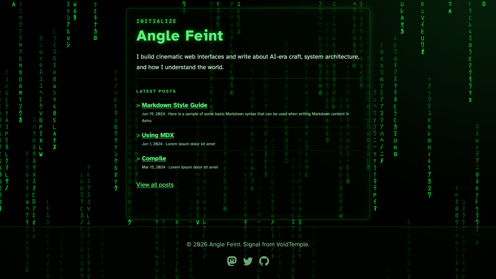
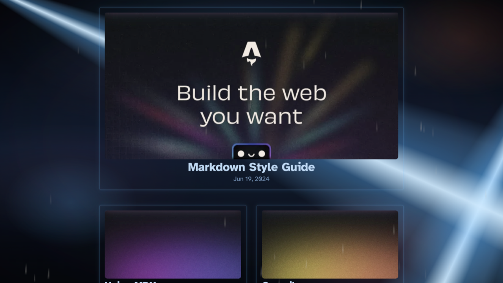
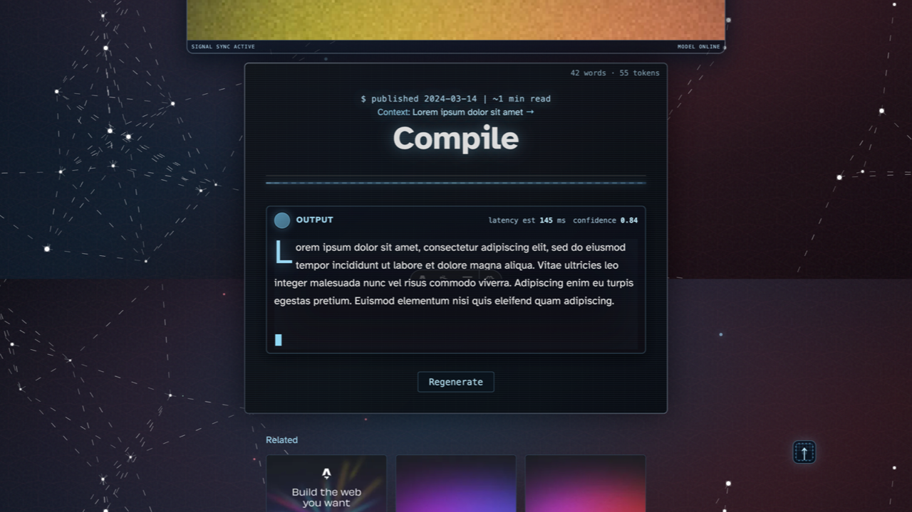
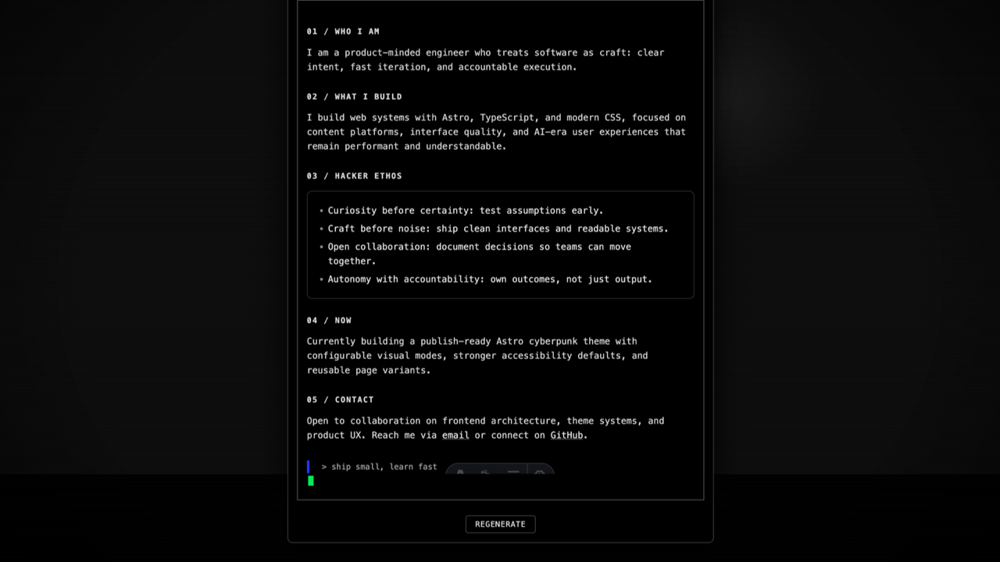

# Anglefeint

A cinematic, multi-atmosphere Astro theme for personal publishing.

## Preview

- Home (`/`): Matrix-inspired terminal landing
- Blog list (`/:lang/blog`): cyberpunk archive mood
- Blog post (`/:lang/blog/[slug]`): AI-interface reading layout
- About (`/:lang/about`): optional hacker-style profile page

## Screenshots

### Home



### Blog List



### Blog Post (Monitor Open)



### Blog Post (Monitor Collapsed)


### About



## Features

- Astro 5 static site output
- Markdown + MDX content collections
- Built-in locales: `en`, `ja`, `ko`, `es`, `zh`
- Per-locale RSS feeds
- Sitemap + robots support
- Config-driven theme options and profile content
- Sticky footer (viewport-bottom on short pages, 2K/4K friendly)

## Quick Start

```bash
npm install
npm run dev
```

Build and preview:

```bash
npm run build
npm run preview
```

## Theme Setup

1. Copy `.env.example` to `.env` and set your site identity variables.
2. Update social links in `src/config/social.ts`.
3. Edit About content in `src/config/about.ts`.
4. Toggle About route/nav in `src/config/theme.ts` via `ENABLE_ABOUT_PAGE`.
5. Replace starter posts in `src/content/blog/<locale>/`.

## Configuration

- Site identity: `src/config/site.ts` (or `PUBLIC_*` env vars)
- Theme behavior: `src/config/theme.ts`
- About content/runtime text: `src/config/about.ts`
- Social links: `src/config/social.ts`

## Project Structure

```text
src/
  components/
  config/
  content/
  i18n/
  layouts/
  pages/
  styles/
public/
  images/
  scripts/
  styles/
```

## Documentation

- Architecture: `docs/ARCHITECTURE.md`
- Visual systems: `docs/VISUAL_SYSTEMS.md`
- Submission checklist: `docs/THEME_SUBMISSION_CHECKLIST.md`
- Theme listing draft: `ASTRO_THEME_LISTING.md`
- AI coding assistant guide: `AGENTS.md`

## License

Licensed under the MIT License. See `LICENSE`.
