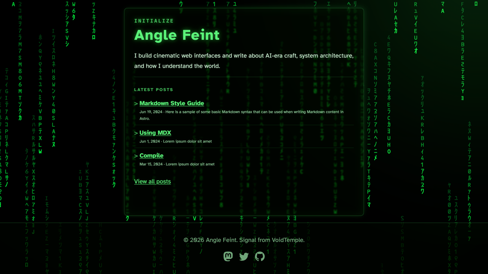
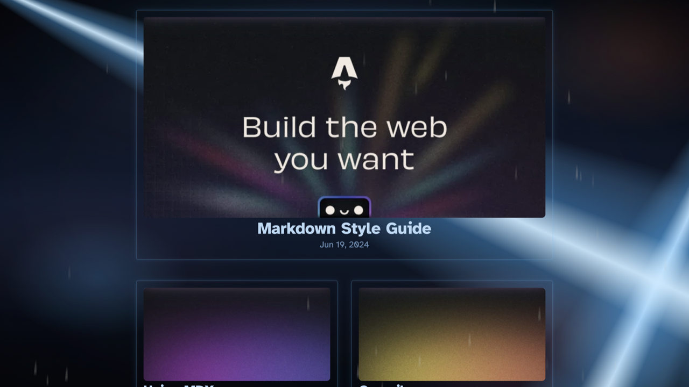
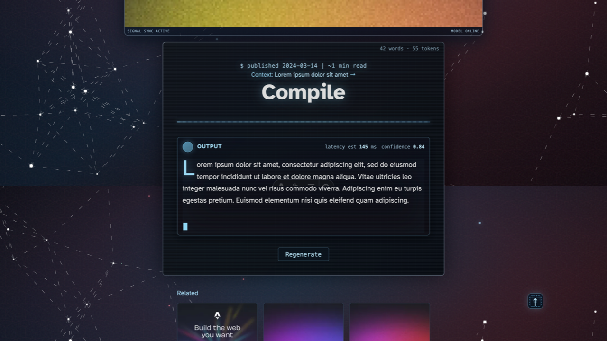
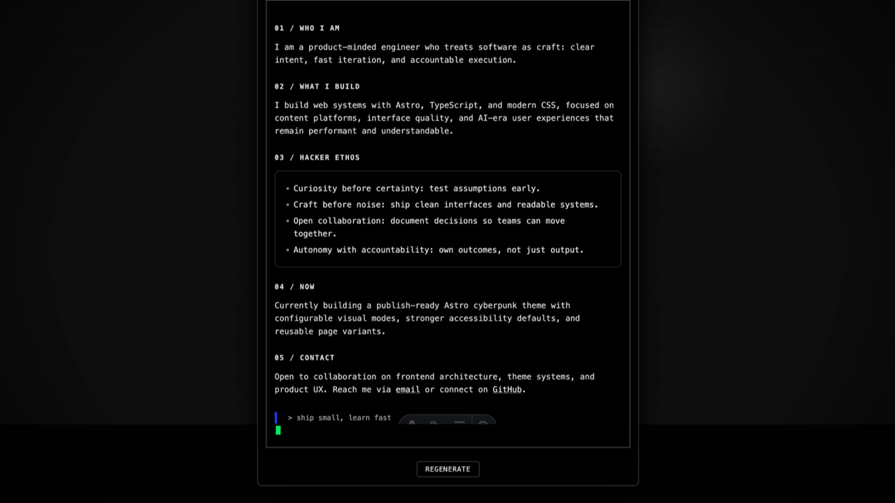

<h1 align="center">Anglefeint</h1>
<p align="center">A cinematic, multi-atmosphere Astro theme for personal publishing.</p>

<p align="center">
  <a href="https://demo.anglefeint.com/">Live Demo</a>
  ·
  <a href="https://github.com/anglefeint/astro-theme-anglefeint">Repository</a>
  ·
  <a href="ASTRO_THEME_LISTING.md">Theme Listing</a>
</p>

<p align="center">
  
  
  
  
  
</p>

## Template Install

```bash
npm create astro@latest -- --template anglefeint/astro-theme-anglefeint#starter
```

Or with `pnpm`:

```bash
pnpm create astro@latest --template anglefeint/astro-theme-anglefeint#starter
```

## Requirements

- Node.js `22.12.0+` (LTS recommended)
- Package manager: `npm`, `pnpm`, `yarn`, or `bun`

## Quick Start

```bash
npm install
npm run dev
```

Build and preview:

```bash
npm run build
npm run preview
```

Quality commands:

```bash
npm run lint
npm run format:check
npm run e2e:install
npm run e2e
```

With `pnpm`:

```bash
pnpm install
pnpm dev
pnpm build
pnpm preview
```

## Upgrade Theme

For package updates in projects created from `#starter`, start with:

```bash
npm update @anglefeint/astro-theme
npm install
npm run doctor
# if doctor reports adapter drift:
# npm run sync-adapters
npm run check
npm run build
```

If release notes mention starter-side contract changes, pull those changes into your project as well. `npm update` alone only updates the published package.

If your custom code still imports `src/consts` or `@anglefeint/astro-theme/consts`, migrate to `src/config/site.ts`.

For Astro major-version migrations, follow the official Astro guide first:

- https://docs.astro.build/en/guides/upgrade-to/
- then re-run this project's `npm run check` and `npm run build`.

## Create New Post

Create the same slug in all configured locales:

```bash
npm run new-post -- my-first-post
```

Slug rule: use lowercase letters, numbers, and hyphens only (example: `my-first-post`).
If default covers exist in `src/assets/blog/default-covers/`, a stable cover is auto-assigned by slug hash (you can replace `heroImage` later).
Optional locale override:

```bash
npm run new-post -- my-first-post --locales en,fr
# or
ANGLEFEINT_LOCALES=en,fr npm run new-post -- my-first-post
```

How URL works:

- File: `src/content/blog/<locale>/my-first-post.md`
- URL: `/<locale>/blog/my-first-post/`
- Blog list: `/<locale>/blog/`
- You do not need to add routes manually. Astro generates them from content files at build time.

## Create New Page

`new-post` creates blog content only. For custom pages, use:

```bash
npm run new-page -- projects --theme base
```

Available themes: `base`, `ai`, `cyber`, `hacker`, `matrix`.
The command creates `src/pages/[lang]/projects.astro` with locale routes via `getStaticPaths()`.
Slug rule: lowercase letters, numbers, and hyphens only; nested paths are allowed (example: `projects/labs`). `_` and uppercase are invalid.

Examples:

```bash
npm run new-page -- projects --theme base
npm run new-page -- projects --theme ai
npm run new-page -- projects --theme cyber
npm run new-page -- projects --theme hacker
npm run new-page -- projects --theme matrix
```

## Languages

English (this file) · [简体中文](README.zh-CN.md) · [日本語](README.ja.md) · [Español](README.es.md) · [한국어](README.ko.md)

## Preview

| Home                                                           | Blog List                                                                |
| -------------------------------------------------------------- | ------------------------------------------------------------------------ |
|  |  |

| Blog Post                                                                     |
| ----------------------------------------------------------------------------- |
|  |

| About                                                            |
| ---------------------------------------------------------------- |
|  |

## Route Atmospheres

- `/<default-locale>/` (with `/` redirecting there by default): Matrix-inspired terminal landing
- `/:lang/blog`: cyberpunk archive mood
- `/:lang/blog/[slug]`: AI-interface reading layout
- `/:lang/about`: optional hacker-style profile page

## Theme Naming Contract

- Theme variants: `base`, `ai`, `cyber`, `hacker`, `matrix`
- Internal selectors/scripts use aligned prefixes: `ai-*`, `cyber-*`, `hacker-*`
- Core composition follows: `ThemeFrame -> Shell -> Layout -> Page`

## Features

- Astro 6 static output (beta track)
- Markdown + MDX content collections
- Starter ships sample locales: `en`, `ja`, `ko`, `es`, `zh`
- Per-locale RSS feeds
- Sitemap + robots support
- Config-driven customization
- Sticky footer (viewport-bottom on short pages)

## Theme Setup

1. Copy `.env.example` to `.env` and set site identity variables.
2. Edit `src/site.config.ts`:
   - `i18n.defaultLocale` to set the canonical root locale
   - `i18n.routing.defaultLocalePrefix` to choose whether the default locale lives at `/<default-locale>/` (default) or `/`
   - `i18n.locales` to add/remove supported locales from a single source
   - `i18n.locales.<code>.messages` for localized UI copy overrides
   - `i18n.locales.<code>.site.hero` for localized home hero copy
   - `i18n.locales.<code>.about` for localized About content/runtime text
   - `social.links` for header/footer links
   - `theme.enableAboutPage` for About route/nav toggle
   - `theme.effects.enableRedQueen` to enable/disable the post-side monitor effect
   - `theme.comments` to enable and configure Giscus (core IDs + behavior options)
3. Replace starter posts in `src/content/blog/<locale>/`.
4. Set your real site URL (`PUBLIC_SITE_URL` or `src/site.config.ts`) before production deploy.

### Optional: Giscus Comments

Comments are disabled by default. To enable:

1. In `src/site.config.ts`, set `theme.comments.enabled = true`.
2. Fill:
   - `theme.comments.repo`
   - `theme.comments.repoId`
   - `theme.comments.category`
   - `theme.comments.categoryId`
3. Optionally customize:
   - `theme.comments.mapping`
   - `theme.comments.term` (required when `mapping = "specific"`)
   - `theme.comments.number` (required when `mapping = "number"`)
   - `theme.comments.strict`
   - `theme.comments.reactionsEnabled`
   - `theme.comments.emitMetadata`
   - `theme.comments.inputPosition` (`top` or `bottom`)
   - `theme.comments.theme`
   - `theme.comments.lang`
   - `theme.comments.loading`
   - `theme.comments.crossorigin`

If these required fields are missing, the comments block is not rendered.

## Configuration Surface

- Single entry: `src/site.config.ts`
- Adapters (do not edit directly): `src/config/site.ts`, `src/config/theme.ts`, `src/config/about.ts`, `src/config/social.ts`
- Environment override supported: `PUBLIC_*` vars for site identity

## Docs

- Architecture: `docs/ARCHITECTURE.md`
- Visual systems: `docs/VISUAL_SYSTEMS.md`
- Submission checklist: `docs/THEME_SUBMISSION_CHECKLIST.md`
- Theme listing draft: `ASTRO_THEME_LISTING.md`
- Upgrading guide: `UPGRADING.md`
- Changelog: `CHANGELOG.md`

## Credits

- Parts of the base typography CSS are adapted from Bear Blog defaults (MIT).  
  Source note is preserved in `src/styles/global.css`.

## License

MIT License. See `LICENSE`.
